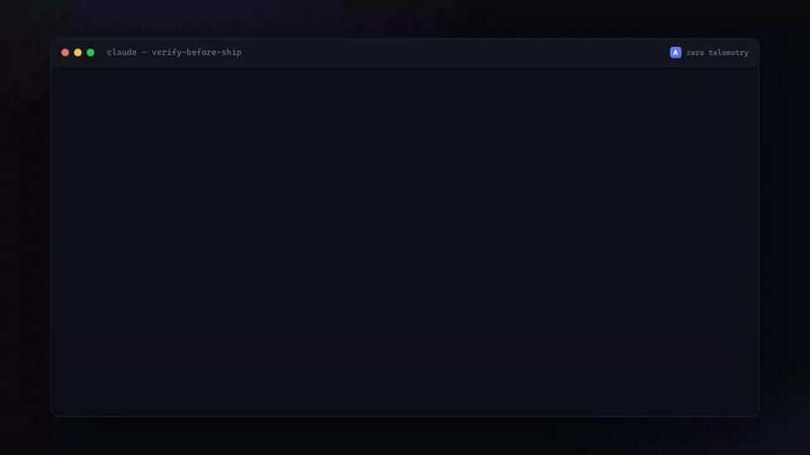

# Axiom open core

Free, MIT-licensed open-core tools from [**Axiom Agent OS**](https://axiom.momentumfocus.org) — the
disciplined, zero-telemetry, bring-your-own-keys engineering layer for Claude Code, Codex, and any LLM
CLI.

This repository is a Claude Code **plugin marketplace**. It currently ships one plugin:

## [`verify-before-ship`](./verify-before-ship)

**Make your coding agent prove a change works — drive the real behaviour and observe it — before it's
allowed to say "done."**



*Every status code in the clip is a real captured server output — the agent catches a `/health`
endpoint that 500s, fixes it, re-drives to a real `200 {"ok":true}`, checks a `405` edge, then ships
with the evidence. ([download mp4](./assets/demo.mp4))*

Green tests and a clean typecheck are necessary, not sufficient. `verify-before-ship` adds one
discipline: the agent must drive the actual change through the actual system and watch it do the thing.
"Done" comes to mean **observed**, not **hoped**. No network calls, no telemetry, no account.

## Install

From inside Claude Code:

```
/plugin marketplace add audhdmomentum/verify-before-ship
/plugin install verify-before-ship@axiom-open-core
```

Then just work — the `verify` skill kicks in before the agent calls a change "done," or run `/verify`
on demand to get an evidence table and a **SHIP / NOT YET** verdict on your current change.

See the [plugin README](./verify-before-ship/README.md) for the full description.

## License

MIT — see [LICENSE](./verify-before-ship/LICENSE). Built by
[Momentum Focus](https://axiom.momentumfocus.org).
